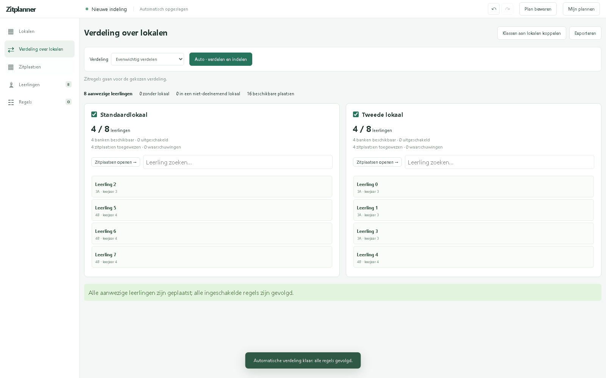

# Zitplanner

Zitplanner is een Nederlandstalige desktopapp om leerlingen over lokalen te verdelen en zitplaatsen te plannen. Je beheert meerdere lokaalopstellingen, voegt leerlingen toe en stelt regels in voor klassen, leerjaren of individuele leerlingen. De app zoekt vervolgens een passende indeling en toont welke leerlingen of regels nog aandacht vragen.

De app is geschikt voor bijvoorbeeld klasindelingen en avondstudie. Leerlinggegevens en projecten worden lokaal op je computer opgeslagen.



## Wat kun je ermee?

- **Lokalen ontwerpen:** maak een eigen plattegrond met banken, stoelen, tussenruimtes en een optionele leerkrachtentafel. Je kunt banken verplaatsen, draaien, dupliceren en in- of uitschakelen.
- **Leerlingen beheren:** voeg leerlingen toe via Excel, CSV of geplakte tabellen. Zoek op naam, klas of leerjaar en pas gegevens rechtstreeks aan.
- **Regels instellen:** bepaal welke leerlingen samen, dicht bij elkaar of juist uit elkaar moeten zitten. Stel regels in per klas, per leerjaar of voor specifieke leerlingen.
- **Aanwezigheden bijhouden:** open **Aanwezigheden** onder Regels, zoek op naam, klas of leerjaar en filter op Aanwezig, Afwezig, **Leerlingen van vandaag** of **Niet-verwachte leerlingen**. De geopende kalenderdag (anders vandaag) bepaalt wie verwacht wordt volgens het avondstudierooster. Niet-verwachte leerlingen krijgen een grijze kaart en zitplaatskleur. Leerlingen starten met een voorlopige aanwezigheid op een lichtgroene kaart; klik om te wisselen naar lichtrood. Na bevestiging worden de kaarten donkergroen of donkerrood. **Leerlingen van vandaag** is het standaardfilter. Kies **Aanwezigheden bewaren** links van Status om de dag te bevestigen. Tot die tijd blijven Excel-dagkolommen grijs en gebruiken zitplaatsen hun gewone kleuren, ook als de indeling al bewaard is. Na een aanwezigheidswijziging moet je opnieuw bevestigen. **↺ Resetten** wist de bevestiging en zet de verwachte leerlingen weer aanwezig, met behoud van de zitindeling en andere dagen. Met **Kleuren op zitplaatsen** rechtsboven toon je aanwezige leerlingen groen en afwezige leerlingen rood op de plattegrond. Selecteer daar een leerling om de status onder **Regel voor deze leerling** te wijzigen. Leerlingen behouden hun zitplaats en de planning blijft behouden. Voorlopige wijzigingen blijven opgeslagen en kunnen ongedaan worden gemaakt; alleen de aanwezigheidsknop bevestigt de registratie voor die datum.
- **Vaste locaties bewaren:** koppel een klas aan een lokaal of leg voor een leerling een lokaal of een specifieke zitplaats vast.
- **Automatisch indelen:** verdeel leerlingen over de deelnemende lokalen en maak de zitplaatsen met één knop.
- **Handmatig bijsturen:** verplaats leerlingen tussen lokalen, sleep ze naar een zitplaats of wissel twee leerlingen om. Wijzigingen kun je ongedaan maken en opnieuw uitvoeren.
- **Kalender en weekplanning:** schakel **Kalender** rechtsboven bij Aanwezigheden of Zitplaatsen in om de kalenderknop te tonen. Deze appinstelling begint uit en wordt daarna onthouden, ook bij andere projecten. Schooldagen bewaren de aanwezigheden, leerlingen en zitplaatsen en kunnen opnieuw worden geopend. Een nieuwe dag blijft een concept tot je **Dag bewaren** kiest of naar een andere dag wisselt; bij dagwissel worden voorlopige aanwezigheden en zitplaatsen automatisch bewaard. Dit bevestigt de aanwezigheden niet; daarvoor kies je **Aanwezigheden bewaren**. Daarna worden wijzigingen automatisch bewaard. Woensdag, zaterdag en zondag zijn niet bewerkbaar. Bekijk een dag, week of maand; kies voor nieuwe dagen **Leeg beginnen**, **Vorige dag kopiëren** of **Andere dag kiezen**. Kopieën starten met iedereen aanwezig. **Vandaag** selecteert de echte huidige datum volgens de Belgische computerklok en opent de dag zonder een startkeuze. Verwijder een bewaarde dag of concept met **Daggegevens verwijderen**. Voor een verwijderde geopende dag verschijnen na het sluiten van de kalender opnieuw de startkeuzes; de verwijderde gegevens worden niet opnieuw automatisch bewaard. Bestaande dagen blijven behouden. Gelijke leerlingenlijsten en opstellingen worden slechts één keer opgeslagen, met per dag alleen de afwezige leerlingen. Excel en herstelbare kalenderbestanden exporteer je via **Export**, voor een dag, week of maand. Kalenderbestanden importeer je in de kalender.
- **Projecten beheren:** werk met afzonderlijke projecten, dupliceer opstellingen en bewaar leerlingenlijsten en plannen.
- **Eén stoel uitschakelen:** klik op een bank en gebruik de knop onder **Bank uitschakelen**. Standaard wordt de tweede stoel (rij 2, 4, …) uitgeschakeld; met **⇄** wissel je naar de eerste stoel (rij 1, 3, …). De andere stoel blijft beschikbaar voor de planner.
- **Exporteren:** maak Excel-bestanden met leerlingen en zitplaatsen, sla een plattegrond op als PDF, PNG of SVG, of druk de indeling af.

## Automatische verdeling

Ga naar **Verdeling over lokalen**, vink de deelnemende lokalen aan, kies een verdeelmodus en klik op **Auto · verdelen en indelen**. De app berekent de lokaalverdeling en zitplaatsen samen, zonder een aparte bevestigingsstap.

De planner gebruikt deze volgorde:

1. Zoveel mogelijk aanwezige leerlingen een zitplaats geven.
2. De ingeschakelde regels volgen op volgorde van belang: **Verplicht**, **Voorkeur**, **Zachte voorkeur**.
3. De gekozen verdeelmodus zo goed mogelijk toepassen.

Een zitregel gaat dus altijd vóór de voorkeur voor de lokaalverdeling. Vaste klaslokalen en ingeschakelde vaste locaties blijven behouden.

| Verdeelmodus | Doel |
| --- | --- |
| **Evenwichtig verdelen** | Leerlingaantallen zo gelijk mogelijk over de lokalen verdelen, rekening houdend met de beschikbare plaatsen. |
| **Capaciteit optimaal gebruiken** | De deelnemende lokalen in volgorde vullen: eerst het eerste lokaal, daarna het volgende. |
| **Klassen spreiden** | Leerlingen uit dezelfde klas zo gelijk mogelijk over de lokalen verspreiden. |
| **Klassen samenhouden** | Leerlingen uit dezelfde klas zo veel mogelijk in hetzelfde lokaal plaatsen en klassplitsingen beperken. |
| **Leerjaren spreiden** | Leerlingen uit hetzelfde leerjaar over de lokalen verspreiden, ongeacht hun klas. |

Als er onvoldoende plaatsen zijn of regels niet allemaal gevolgd worden, blijven ongeplaatste leerlingen en waarschuwingen zichtbaar. De planner gebruikt een heuristische zoekmethode en garandeert niet voor iedere combinatie de wiskundig optimale indeling.

Via **Zitplaatsen → Indeling maken…** kun je ook de zitplaatsen van één lokaal of alle deelnemende lokalen opnieuw maken. Daar kies je tussen **Willekeurig** en **Geordend**, met instelbare vulrichtingen voor Geordend.

## Installeren en starten

### Windows-installatie

Download **Zitplanner-Setup-2.0.0-x64.exe** bij de [GitHub-releases](https://github.com/Zyric99/ZitPlanner/releases/latest) en open het bestand. De Nederlandstalige installatie laat je kiezen tussen je eigen Windows-account en alle gebruikers. Je kunt de installatiemap aanpassen; er worden snelkoppelingen aangemaakt voor het bureaublad en het startmenu. Node.js en npm zijn niet nodig voor deze versie.

De geïnstalleerde app bewaart projecten in `%APPDATA%\Zitplanner\projects`. Bij de eerste start wordt alleen het meegeleverde standaardproject aangemaakt. Bestaande projecten blijven bij opnieuw installeren en updates behouden. Verwijderen kan via **Windows-instellingen → Apps → Geïnstalleerde apps**. In de uninstaller staat **Ook gegevens en projecten verwijderen** standaard uit. Alleen als je deze optie aanvinkt, worden de projecten, back-ups en instellingen in `%APPDATA%\Zitplanner` voor je huidige Windows-account definitief verwijderd. Gegevens van andere accounts, de ontwikkelversie en exportbestanden buiten die map blijven behouden.

De installer heeft nog geen codeondertekeningscertificaat. Windows kan daarom een melding over een onbekende uitgever tonen. Controleer dat je de installer uit deze repository hebt gedownload.

### Vanuit de broncode

Voor onderstaande ontwikkelversie heb je **Node.js met npm** nodig. De Windows-startscripts installeren Electron bij de eerste start als dat nog ontbreekt.

### Via de opdrachtregel

```sh
git clone https://github.com/Zyric99/ZitPlanner.git
cd ZitPlanner
npm ci
npm start
```

### Via het Windows-startscript

Open de map `scripts/` en dubbelklik op **Start Zitplanner.cmd**.

**Start Zitplanner Dev.cmd** staat in dezelfde map en opent de app met extra technische informatie voor ontwikkelaars. Beide scripts gebruiken dezelfde projectgegevens.

### Browservoorbeeld

```sh
npm run preview
```

Open daarna [http://127.0.0.1:4173](http://127.0.0.1:4173). Dit is een browservoorbeeld; de desktopapp biedt de volledige projectopslag en desktopfuncties.

## Eerste indeling maken

1. Open **Projecten** en maak eventueel een nieuw, leeg project.
2. Maak onder **Lokalen** de gewenste opstellingen en controleer de beschikbare plaatsen.
3. Voeg onder **Leerlingen** je leerlingenlijst toe. De meegeleverde bestanden met fictieve leerlingen kun je gebruiken om de app uit te proberen.
4. Stel onder **Regels** de gewenste klas-, leerjaar- en leerlingregels in en schakel de benodigde categorieën in.
5. Kies onder **Verdeling over lokalen** de deelnemende lokalen en een verdeelmodus. Klik op **Auto · verdelen en indelen**.
6. Bekijk de waarschuwingen en open de zitplaatsen van een lokaal om de indeling bij te sturen.
7. Kies **Exporteren** om de indeling te delen of af te drukken.

## Meegeleverd standaardproject

Alleen het opgeslagen **Standaard project** wordt meegeleverd, als [defaults/standaard-project.json](defaults/standaard-project.json). Via **Projecten → Importeren** kun je dit bestand als een afzonderlijk project openen, inclusief de opgeslagen opstellingen, leerlingen en regels. Je eigen projecten blijven behouden.

Andere opgeslagen projecten, de lokale werkruimte-instellingen en herstelkopieën staan niet in deze repository.

Via **Projecten → Terugzetten naar standaard…** kies je tussen terugzetten met of zonder een nieuwe backup. De bevestiging toont de backupmap: in de geïnstalleerde app is dat `%APPDATA%\Zitplanner\projects\backups`. Projectbackups van terugzetten, verwijderen en migratie worden na 30 dagen automatisch opgeruimd; de app controleert dit eenmaal bij het starten. De oorspronkelijke standaard en vaste migratiebestanden blijven bewaard.

## Import en export

De repository bevat voorbeeldbestanden:

- [Avondstudie_100_Fictieve_Leerlingen.xlsx](examples/Avondstudie_100_Fictieve_Leerlingen.xlsx): een oefenlijst met 100 fictieve leerlingen.
- [Avondstudie_180_Fictieve_Leerlingen.xlsx](examples/Avondstudie_180_Fictieve_Leerlingen.xlsx): een oefenlijst met 180 fictieve leerlingen.

Bij Excel-export kies je de kolommen en hun volgorde, bijvoorbeeld **Naam**, **Klas**, **Leerjaar**, **Lokaal** en **Plaats**. Je kunt alle leerlingen op één werkblad zetten of een apart werkblad per klas maken. Zitplaatsen worden aangeduid met herkenbare stoelcodes, zoals **A1** en **A2**.

Bij import worden **Naam** of **Volledige naam**, **Voornaam + Achternaam/Familienaam**, en **Naam + Voornaam** herkend via de kolomkoppen. Bij Naam + Voornaam betekent Naam de achternaam. Voor één naamkolom kies je de **Naamvolgorde**: **Voornaam achternaam** of **Achternaam voornaam**. Bij die laatste keuze is het laatste woord de voornaam en de rest de achternaam. Controleer de naamvelden in de voorvertoning. Gebruik aparte naamkolommen voor samengestelde voornamen; neem bij Excel-export **Voornaam** en **Achternaam** op om die verdeling bij opnieuw importeren te behouden.

Bij **Hele week** staat **Dag** standaard aangevinkt. Voeg **Leerjaar** toe om handmatige correcties mee te exporteren; bij import van Excel of CSV blijft een geldig meegeleverd leerjaar behouden.

Eerder opgeslagen of geïmporteerde weekindelingen kunnen worden bekeken, aangepast en geëxporteerd. In de huidige interface kun je geen nieuwe volledige weekindeling genereren.

## Opslag

De desktopapp slaat wijzigingen automatisch op: de geïnstalleerde versie gebruikt `%APPDATA%\Zitplanner\projects`, de ontwikkelversie de map `projects/` in de hoofdmap. Een project bevat onder andere de lokalen, leerlingen, regels en zitplaatsen. De app maakt herstelkopieën bij belangrijke opslag- en projectacties.

Via **Projecten** en **Exporteren** kun je projecten beheren en een volledig projectbestand als JSON bewaren of importeren. De browserpreview gebruikt lokale browseropslag.

De app verstuurt geen leerlinggegevens naar een server. De lokale projectmap, afhankelijkheden, caches en testartefacten worden niet opgenomen in deze Git-repository.

## Mappenstructuur

```text
src/        Interface, planner en overige appmodules
desktop/    Electron, koppeling met de interface en projectopslag
scripts/    Windows-startscripts en lokale browserpreview
build/      Configuratie voor de Windows-installer
examples/   Excel-voorbeeldbestanden met fictieve leerlingen
defaults/   Het meegeleverde standaardproject
assets/     Pictogrammen en schermafbeeldingen
docs/       Technische documentatie
tests/      Automatische tests
```

De README, licentie en npm-configuratie staan in de hoofdmap. De lokale map `projects/` blijft op dezelfde plek en wordt niet gepubliceerd.

## Ontwikkeling en controles

Zitplanner gebruikt **Electron** en JavaScript-modules. De lokaalverdeling en zitplaatsplanning draaien op de achtergrond in een worker.

```sh
npm run check
npm test
```

Voor desktopcontroles zijn onder andere deze opdrachten beschikbaar:

```sh
npm run test:auto
npm run test:rooms
npm run test:ui
```

Testartefacten en schermafbeeldingen worden bewaard in `artifacts/`. De uitgebreide technische documentatie staat in [docs/technische-handleiding.md](docs/technische-handleiding.md).

Met `npm run dist:win` bouw je de Windows-installer in `dist/`. Daarna controleert `npm run test:packaged` het echte `.exe`-bestand met een afzonderlijk testprofiel. `npm run test:uninstaller` controleert de standaard uitgeschakelde verwijderoptie, het opruimen van gegevens en het behoud van gegevens bij updates met geïsoleerde testprofielen. De installer bevat uitsluitend de appcode, pictogrammen, licentie en het standaardproject; lokale projecten, tests en caches worden niet meegeleverd. Er is geen automatische updater: installeer een nieuwere release over de bestaande installatie om bij te werken.

## Licentie

Dit project is beschikbaar onder de [GPLv3-licentie](LICENSE).
